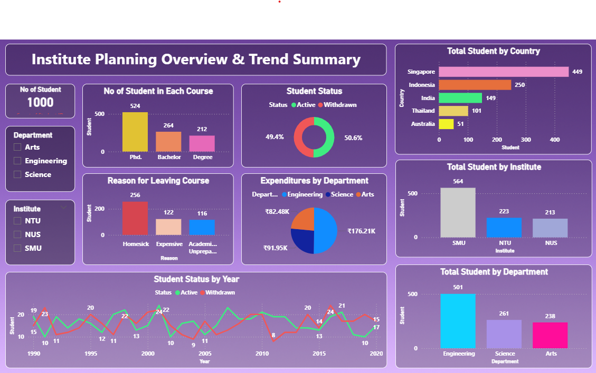

# 📊 Institute Planning Overview and Trend Summary (Power BI)

## 📌 Project Overview

This project presents an interactive **Institute Planning Overview and Trend Summary Dashboard** built using **Power BI**. It provides a comprehensive view of student distribution, enrollment trends, departmental performance, and institutional comparisons.

The dashboard enables stakeholders to analyze historical patterns, identify key drivers of student behavior, and support strategic planning decisions.

---

## 📸 Dashboard Preview

<p align="center">
  
</p>

---

## 🔍 Key Insights from Dashboard

* 📈 **Student Trends Over Time**: Year-wise analysis of active vs withdrawn students
* 🌍 **Geographical Distribution**: Country-wise student concentration
* 🏫 **Institute Comparison**: Student distribution across institutes (SMU, NTU, NUS)
* 🎓 **Course Breakdown**: Enrollment across PhD, Bachelor, and Degree programs
* ⚠️ **Dropout Analysis**: Key reasons for course withdrawal (homesick, expensive, academic pressure)
* 💰 **Department Expenditure**: Budget allocation across departments (Engineering, Science, Arts)

---

## 🗂️ Data Sources

* **Institute Planning.csv** – Contains student data, course details, status, and demographics

---

## ⚙️ Tools & Technologies Used

* **Power BI Desktop**
* **Power Query** – Data cleaning & transformation
* **DAX (Data Analysis Expressions)** – Measures & calculations

---

## 🔄 Data Preparation

* Cleaned and transformed raw dataset using Power Query
* Handled missing and inconsistent values
* Standardized categorical fields (status, department, country)
* Prepared data for time-series and categorical analysis

---

## 🧠 Data Modeling

* Designed a structured data model for efficient reporting
* Created calculated measures using DAX for:

  * Student count
  * Active vs withdrawn ratio
  * Department-wise metrics
* Optimized model for performance

---

## 📈 Dashboard Features

### 📊 Student Analysis

* Total number of students
* Course-wise student distribution
* Department-wise student count

### 📉 Trend Analysis

* Year-wise student status (Active vs Withdrawn)
* Historical trends for performance tracking

### 🌍 Geographic Insights

* Country-wise student distribution

### 🏫 Institutional Insights

* Student distribution by institute (SMU, NTU, NUS)

### ⚠️ Dropout Analysis

* Reasons for leaving courses
* Comparative dropout factors

### 💰 Financial Insights

* Department-wise expenditure analysis

---

## 📊 Key Metrics

* Total Students: **1000**
* Active vs Withdrawn Ratio
* Department-wise student distribution
* Institute-wise enrollment comparison

---

## 🚀 How to Use

1. Download the `.pbix` file from the `dashboard` folder
2. Open in **Power BI Desktop**
3. Refresh data if needed
4. Use filters and visuals for interactive analysis

---

## 📁 Project Structure

```id="c0gqhb"
Institute-Planning-Overview-and-Trend-Summary
 ┣ 📂 dashboard
 ┃ ┗ Institute-Planning-Overview-and-Trend-Summary.pbix
 ┣ 📂 data
 ┃ ┗ Institute Planning.csv
 ┣ 📂 images
 ┃ ┗ dashboard.png
 ┗ README.md
```

---

## 🎯 Future Enhancements

* Predictive analysis for student dropout
* Real-time data integration
* Advanced KPI tracking
* Enhanced UI/UX with dynamic visuals

---

## 🤝 Contributing

Contributions are welcome! Feel free to fork this repository and submit a pull request.

---

## 📬 Contact

For any queries or feedback, feel free to connect.
